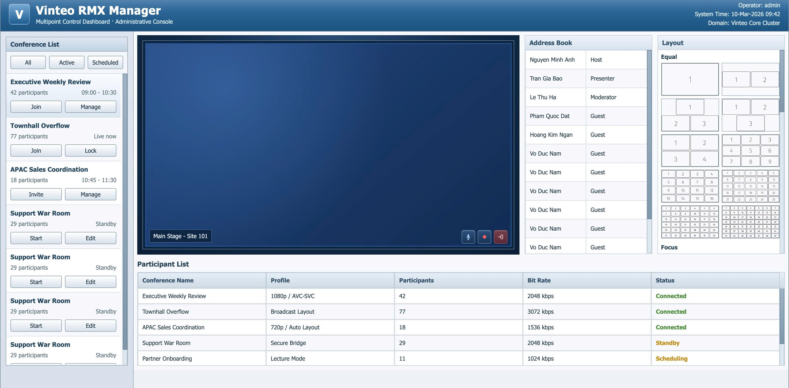

# Vinteo RMX Manager

Vinteo RMX Manager is a Django-based operations dashboard for Vinteo conferencing systems.

## Screenshot



## Overview

This project provides a web console for conference operations and proxies browser requests to the upstream Vinteo API.

Core flow:

```text
Browser UI -> Django Dashboard -> /api/vinteo/<endpoint> -> Upstream Vinteo API (BASE_URL)
```

## Main features

- Conference list management: load, search, create, update, delete, start, stop.
- Conference Settings modal with multiple tabs (`Main`, `Call`, `Connection`, `Advanced`).
- Participant list polling with search/sort and per-participant status enrichment.
- Per-participant actions: mic/camera/audio/video toggle, disconnect, context menu.
- Bulk participant controls: mute mic/camera/audio/video for selected conference.
- Layout manager (Equal/Focus presets) with drag-and-drop participant placement.
- Stage stream manager with HLS playback, preview fallback, and lecturer focus actions.
- Address book panel (group/participant add interactions in current UI layer).
- Django admin customization templates for branded admin pages.

## Tech stack

- Backend: Python 3.14, Django 6.
- Frontend: Vanilla JavaScript modules, Axios, HLS.js.
- Database: PostgreSQL (when env vars are set) or SQLite fallback.
- Containerization: Docker + docker-compose (web, db, pgAdmin).

## Project structure

```text
.
|- README.md
|- docs/
|  \- images/
|     \- dashboard-preview.jpg
|- vinteo.md                     # upstream API reference
|- vinteo_app/
|  |- manage.py
|  |- requirements.txt
|  |- package.json
|  |- Dockerfile
|  |- docker-compose.yaml
|  |- .env
|  |- static/
|  |- templates/
|  \- vinteo_app/
|     |- settings.py
|     |- urls.py
|     |- views.py
|     \- api/
|        |- auth.py
|        \- client.py
```

## Prerequisites

- Python 3.14+ and pip
- (Optional) Docker + Docker Compose
- Access to a Vinteo API host (`BASE_URL`) with valid credentials

## Run locally

From `vinteo_app/`:

```bash
python -m venv .venv
.venv\Scripts\activate
pip install -r requirements.txt
python manage.py migrate
python manage.py runserver
```

Open:

- `http://127.0.0.1:8000/` (dashboard)
- `http://127.0.0.1:8000/admin/` (admin)

Optional:

```bash
python manage.py createsuperuser
```

## Environment setup

Create/update `vinteo_app/.env` (minimum required for upstream proxy):

```env
BASE_URL=https://your-vinteo-host
VINTEO_USERNAME=your-username
VINTEO_PASSWORD=your-password
VINTEO_VERIFY_SSL=false
```

Common app settings:

```env
DEBUG=True
SECRET_KEY=change-me
ALLOWED_HOSTS=127.0.0.1,localhost

POSTGRES_DB=vinteo_db
POSTGRES_USER=vinteo_user
POSTGRES_PASSWORD=vinteo_password
POSTGRES_HOST=db
POSTGRES_PORT=5432
```

Notes:

- If PostgreSQL variables are not fully provided, Django uses SQLite (`db.sqlite3`).
- Proxy route supports `GET/POST/PUT/PATCH/DELETE`: `/api/vinteo/<path:endpoint>`.

## Run with Docker

From `vinteo_app/`:

```bash
docker compose up --build
```

Default service endpoints:

- App: `http://127.0.0.1:8000`
- PostgreSQL: `localhost:5432`
- pgAdmin: `http://127.0.0.1:5050`

## Internal routes

- `/` dashboard page
- `/admin/` Django admin
- `/api/vinteo/<path:endpoint>` backend proxy to upstream Vinteo API

## API reference

See `vinteo.md` for the upstream Vinteo endpoint catalog (`/api/v1` and `/api/v2`).
